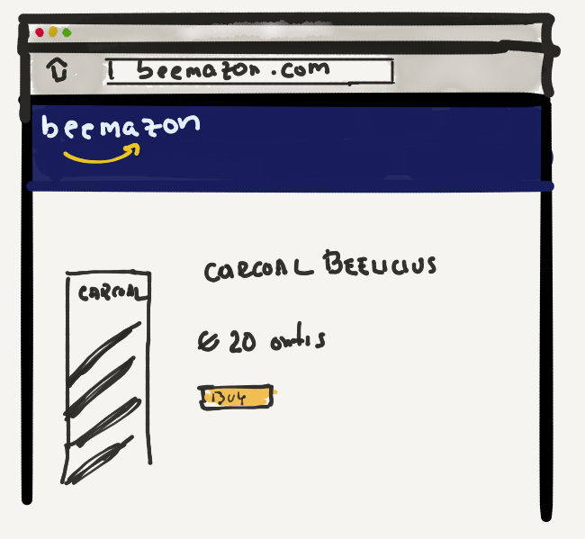
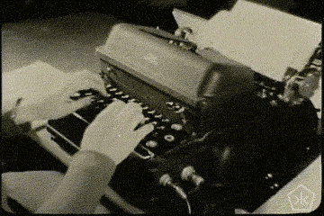

Érase una vez, en el lejano reino de **HoneyPot**, un estudiante de arte llamado Brutus.

Brutus acababa de ser admitido en el prestigioso taller Leonardo.

Había soñado, desde la más tierna edad, con la idea de convertirse en un gran arista. Contento e ilusionado por su admisión, Brutus se dipuso a hacer los preparativos necesarios para comenzar su carrera.

> Este verano haré un programa de estudios infalible y comenzaré las clases como todo un profesional!

Exclamó Brutus con entusiasmo y se dispuso a contemplar las posibilidades a su alcance.

> Posibilidades infinitas = Parálisis

Así pues, Brutus pasó tres semanas construyendo la primera parte de su plan de aprendizaje.

Esta consistiría en la búsqueda de información y de recursos didácticos sobre el dibujo y la pintura.

Buscó y recolectó decenas de libros de arte, artículos, cursos y hasta tutoriales en HiveTube!

Pasó también _-no pocas-_ horas clasificando la excesiva cantidad de información que recababa.

Finalmente, y tras haber recorrido cada rincón del internet, se contentó con _unos pocos recursos_ : Alrededor de 300 gigabytes de información cuyo estudio integral podría tomar toda una vida para una abejita común y corriente. Pero Brutus no era una abejita común y corriente _-o eso se decía él para justificar su embriaguez de información, su **infoxicación**_

> "Finalmente tengo todo lo que necesito" — se dijo con orgullo.

---

> No puedes echarle agua a un vaso que ya está desbordando

Brutus había recolectado una cantidad inhumana _-o más bien, ¿inabejana?_ 🧐- de información y recursos didácticos. Información que no solo era excesiva, sino que también estaba despedigada por todo su disco duro _-los bookmarks en el navegador, los libros en el lector de ficheros, los tutoriales en una lista de reproducción de <a href="{{ youtube }}">HiveTube</a>, etc...-_ Su gestión era pues extremadamente díficl, ¿cómo manejar entonces toda esta información de forma eficaz?

Hummp...

.

.

.

.

.

.

.

.

.

.

.

.

> "Estableceré un sistema de prioridades para clasificar esta información en función de su pertinencia y así facilitaré su estudio" —se dijo tras unos momentos de reflexión

Nuestra pequeña abejita pasó pues todo el mes concibiendo un sistema de prioridades. Mientras realizaba esta tarea increíblemente productiva, se dió cuenta de que necesitaría también una aplicación de gestión de tareas para gestionar eficazmente los recursos y tareas.

Una vez más, un interrogante se añadía a la lista: ¿Qué aplicación utilizar?

Después de haber probado durante unas cuantas semanas todas las aplicaciones de gestión de tareas habidas y por haber, encontró finalmente la aplicación perfecta: _BeeDo_.

Brutus estaba feliz. Tenía _-por fin-_ todo o que necesitaba para empezar!

Bueno, eso creyó en un principio...

Cuando estaba a punto de comenzar a aplicar su _"maravilloso"_ _-ejem, ejem-_ sistema de aprendizaje _-y lo más importante: a aprender-_ una idea se deslizó delicadamente sobre su cabecita...

> _"Mmmm, debería distrbuir todas estas tareas y recursos a lo largo del año. Así sería más eficaz y rápido"_

...Y otra idea más...

> _"Hummp. Debería también hacer una estimación del tiempo que voy a dedicar a cada tarea..."_

..y otra...

> _"Para ello, ¿no debería primero definir los tipos de tarea?"..._

Y así una avalancha de ideas para mejorar su sistema de aprendizaje se desplomó sobre su pequeña cabeza, demasiado pequeña como para acojer y gestionar todas esas revelaciones al mismo tiempo. Brutus se dió cuenta entonces que el aprendizaje del dibujo era una cosa mucho más complicada de lo que creía...

Dispuesto a optimizar al máximo su sistema antes de empezar a aplicarlo, decidió pues hacer frente a esta colosal tarea con determinación, a final de cuentas, el tiempo que iba a ganar después era precioso ¡valía la pena! _-¿verdad?_

Tras un par de meses de trabajo duro y con el inicio del semestre acercándose peligrosamente, Brutus había terminado su sistema de aprendizaje _"The Brutus Art Roadmap 5000"_. Estaba orgulloso. Sólo quedaba pasar a la acción, aplicarlo. Su carrera artística despegaría cómo un cohete, nada podría entonces interponerse entre él y el triunfo!

Eeeh...

.

.

.

.

.

.

Un momento...

.

.

.

.

.

.

Esperad...¿No se nos olvida algo?

.

.

.

.

.

.

> _"Los materiales de dibujo!"_

Había olvidado lo más esencial! ¿Qué materiales iba utilzar? ¿Pinceles de la marca _Beecius_? ¿Cuadernos de la marca _Beelicious_?...

Brutus provenía de una familia acomodada. El costo de los materiales no suponía pues un problema. Quería comenzar las clases con las mejores herramientas que pudiera procurase.

Se dispuso pues _-una vez más-_ a investigar y así un universo de materiales y marcas se abrió ante sus ojos y con este, un paquete de preguntas vinieron a añadirse a su ista de preocupaciones:

> _¿Cuál es la mejor marca? De esta marca, ¿cuál es el mejor píncel? Esta es la mejor marca para cuadernos pero, ¿es acaso la mejor marca para lápices? etc..._

No estaba dispuesto a conformarse con herramientas mediocres. Brutus quería empezar su carrera con la _crème de la crème_. Pasó pues varias semanas seleccionando marcas tras investigar su reputación. Una vez elegidas las marcas, pasó otras cuantas semanas maquinando una cuidadosa lista de productos, poniéndo especial cuidado y enfásis en los carboncillos, pieza clava de su plan de aprendizaje _-pues se había obsesionado con empezar con dicha técnica-_.

Lo que se divisaba en un principio cómo una tarea fácil y sencilla -_al fin y al cabo, leer unas cuantas reseñas y **tomar una decisión** no es algo especialmente complicado ¿verdad?-_ se torno en una tarea agotadora y _-extrañamente-_ placentera _-¿acaso sería porque a pesar de ser pesada seguía siendo diez mil veces más fácil que ponerse a producir arte?_

> Dios no lo hizo todo en un solo día. ¿Qué me hace pensar que yo sí podría?

Brutus hizo un pedido en Beemazon, entre los productos que compró habían un par de cajas de carboncillos de la marca _Beelicious_

Dos segundos después recibió lo que en un principio creyó que era un correo de confirmación...

> _Estimado cliente. Lamentamos tener que informarle que a causa de una falta de stock, el envío de su artículo (Carchoal Beelicius) se verá retrasado dos meses._
>
> _Sepa disculpar las molestias. Quedo a su disposición para más información_
>
> _Aurelia. Su contacto en Beemazon._

Resignado. Derrotado. Abatido.

Brutus se dispuso a esperar.

Mientras tanto, la idea de intentar adaptar su sistema para comenzar a aplicarlo sin los carboncillos vino a su mente. Lástima que esta idea no decidiera quedarse. Brutus desistió al darse cuenta de que por extraño que pareciera, **no estaba lo suficientemente motivado**.

Decidió pues consagrar su tiempo a otras edificantes actividades mientras esperaba que su motivación volviera.

> La motivación es lo que te hace dar el primer paso del camino, la disciplina es lo que evita que te salgas de él

Para concluir:

Brutus empezó las clases sin ninguna variación en su nivel, pues no dibujó absolutamente nada [durante el verano](/es/blog/sacarle-punta-al-lapiz-ii). Mientras tanto, otros compañeros de clase aprovecharon al máximo las vacaciones [para aumentar su nivel](/es/blog/sacarle-punta-al-lapiz-i). El programa que preparó no le sirvió de nada, pues nunca lo aplicó. Brutus aprendió una valiosa lección:

>  Planificar es mucho más fácil que actuar

Planificar provoca una falsa sensción de progreso, es una tarea bastante agradable, pero mientras no actúes, planificar no te va acercar a tus objetivos. Planficar en exceso es una forma de sobrestimar nuestra productivdad y motivación futuras, es una forma de auto-engaño, de [ensoñación](http://www.rinconcastellano.com/cuentos/samaniego/samaniego_lechera.html), de procrastinación.

La planifiación sin la acción es una trampa a evitar a todo precio.

> Hecho es mucho mejor que perfecto. Bien es suficiente

La organización y la previsión son herramientas útiles mientras no nos estanquemos en ellas. En esta pequeña fábula hemos podido observar que Brutus quería sí o sí tener todos los elementos bajo control creyendo que era capaz de preveerlo todo. No era consciente de que hay cosas que **solo podemos ver una vez nos hemos ensuciado las manos** en el terreno, nunca antes.

> Un "tengo" vale más que dos "tendré"

**No somos omniscientes**. Nuestra mente modela la realidad con las pocas piezas que tiene, piezas bastante **[poco fiables](https://es.wikipedia.org/wiki/Sesgo_cognitivo)**. Percibimos el mundo a través de sentidos limitados e interpretamos estas percepcionés a través de un sistema nervioso que también es limitado. Con tal panorama no podemos preveerlo todo, por ello, en cualquier proyecto que emprendamos encontraremos siempre imprevistos, piedras en el camino.

Querer preveerlo todo es tan descabellado cómo querer escribir un ensayo de diez mil páginas en una vieja máquina de escribir sin equivocarse al teclear ni una sola vez.

> _Ni siquiera los escritores más experimentados escapan al proceso de edición y de corrección._

Querer preveerlo todo es tan descabellado cómo pedirle a un equipo de ingenieros que fabrique un cohete cien por cien funcional desde zero y sin pasar por modelos intermedios.

> _Ni siquiera los ingenieros más brillantes del mundo pueden diseñar un producto final sin prototipar primero. Es el prototipo el que, corrección tras corrección y a base de ensayo y error, se convierte en producto final._

Durante su planificación Brutus se encontró con varias piedras en el camino. Tuvo pues que **adaptar su plan en varias ocasiones**.

Entonces, si pase lo que pase -_panifiquemos mucho o poco-_ tendremos que modificar el plan inicial ¿Por qué no empezar con un plan minimalista y ponerse manos a la obra desde un principio? ¿Por qué obsesionarse y perderse en la planificación? ¿Por qué no desarrollar el superpoder de trabajar con imprevistos _-e incluso abrazarlos-_?

Las ventajas de la acción sobre la planificación es que nos lleva mucho más rápido a encontrarnos con los imprevistos, y quién dice encontrarse, **dice solucionar**

Puede que la temática de este artículo suene bastante similar al artículo de [inaguración del blog](/blog/la-colmena-de-mrbee). Puede que sonemos redundates, ¿qué importa? **las cosas importantes merecen ser repetidas**.

- Encuentra la piedrecita más pequeña necesaria a la construcción de tu castillo
- No esperes ni un segundo para ponerla. Es tan pequeña y fácil de poner que no tienes excusa
- Encuentra la segunda piedrecita más pequeña y haz lo propio
- Planifica de forma moderada. En caso de duda, primero la acción, luego la planificación.

_Este artículo es una descarada adaptación de ["No necesitas más información, sino acción"](https://wmedia.es/no-necesitas-mas-informacion-necesitas-accion/) [(Wmedia)](//wmedia.es), cuya lectura recomendamos encarecidamente_
