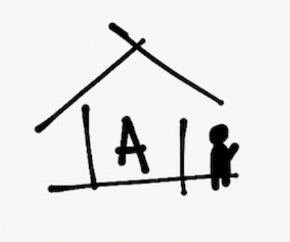
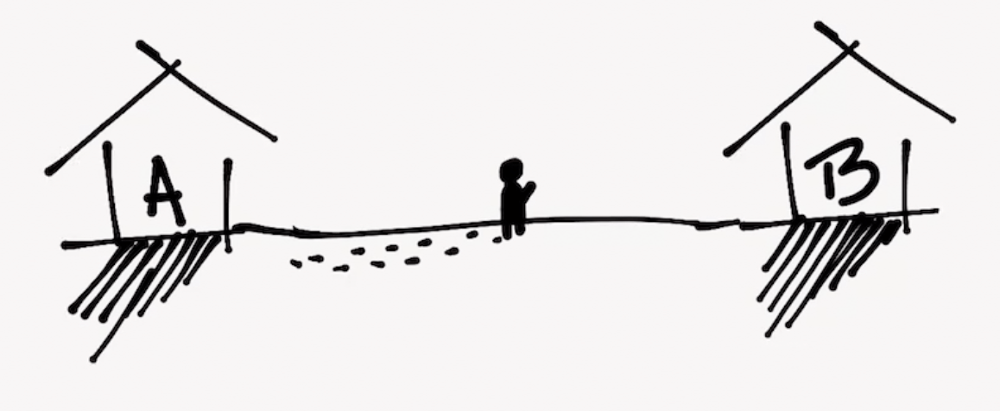
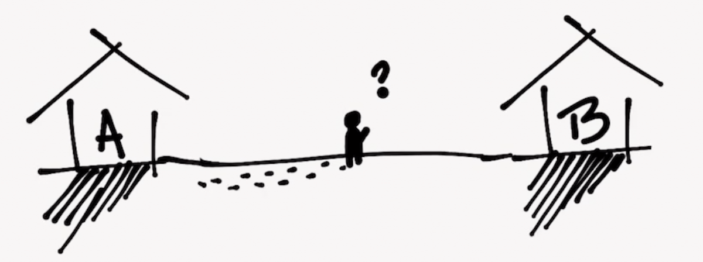
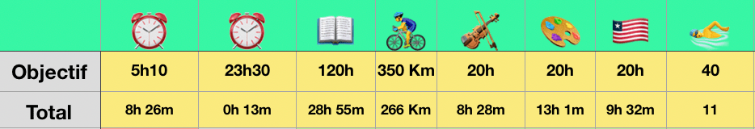

Estás en el punto A.

Te gustaría estar en el punto B.

A y B están separados.

Para ir a B hay que caminar.

No conoces la distancia que separa los dos puntos. Sólo tienes una idea de en qué dirección se encunetra B.

Puedes, sin embargo, hacer una estimación...

Para ir a B podrías :

1. Simplemente partir del punto A con la idea de llegar a B.
2. Partir del punto A con la idea de caminar 10 Km.

En el primer caso, tu atención está puesta en el resultado. Tu mente, energía y recursos están fijos en él. El fin, la línea de meta. Tu consciencia vive en el futuro.

Se trata de un objetivo cualitativo : Lo que importa es la calidad del resultado, pues en tu pequeña cabeza de inconformista estimas "B" mucho mejor que "A" — _y por tanto, **cualitativamente** superior_

> El futuro no existe

En el segundo caso, tu atención está puesta en el camino.
Tu objetivo es simplemente caminar.

Cada kilómetro que avanzas es una pequeña victoria, una alegría. Te tomas la molestia pues de contarlos con cariño — _con lo que te ha costado, sería una pena equivocarse en las cuentas_ —

El contarlos te permite ser consciente de tu progreso.

Tu consciencia está en cada pequeño paso que das.

.

.

.

Estás **presente**

Cada kilómetro te acerca más y más de B, a pesar de que no era tu objetivo principal y que tus estimaciones puedan ser erróneas.

Estimaste que te tenías que caminar 10 Km y lo hiciste. Estableciste un _objetivo cuantitativo o numérico_

Un objetivo es **un deseo**. El deseo de estar en B en lugar de en A.

Pero...

Los objetivos irrealizados son a menudo fuente de frustración, ansiedad y dolor.

> Relajación es quien eres. Estrés es quien crees que deberías ser.

A menudo deseamos llegar a B lo mas rápido posible y caminando lo mínimo.

Es lógico, pues nuestro cerebro es una máquina de automatismos que prefiere evitar el gasto innecesario de energía.

Pero, malas noticias...

Siempre habrá una distancia que separará A y B.

No hay atajos. Si queremos ir a B deberemos atravasar esa distancia.

Es invitable. Una ley cósmica.

### 💡 Entonces, si...

Siempre habrá que recorrer una distancia...

Por qué no cambiar nuestro deseo de llegar por el deseo de caminar?

No sería más sabio ?

### 💡Y si...

Proyectarse en el futro puede frustranos y minar nuestro bienestar y estado mental...

Por qué no fijarse una cantidad de pasos a caminar y concentrarse y regocijarse con cada pasito?

No sería esta una mejor forma de vivir el presente mientras te acercas al mismo tiempo a ese futuro que buscas?

### Tres posibilidades

Si decides adoptar un objetivo numérico y estimas la distancia en 10 Km, tres situaciones son posibles :

1. Tenías razón. A y B están separados por una distancia de 10 Km. Felicitaciones!
2. A y B están más cerca de lo que creías.
3. A y B estás separados por una distancia mayor a la que estimaste.

Como habrás adivinado, la última opción es la más probable, sin embargo...

Incluso si te equivocas en tus estimaciones :

- ☑︎ Habrás aprovechado mucho más el viaje
- ☑︎ Estarás mucho más presente en tu propia vida
- ☑︎ Aprenderás a calibrar mejor tus estimaciones
- ☑︎ Tendrás una visión más realista y precisa de tus capacidades

Y sobre todo — _y créeme_ — estarás mucho más cerca de la meta.

### Conclusión

Los objetivos numéricos tienen un potencial extraordinario para cambiar tu vida a mejor y acercarte más a ese futuro que deseas.

Fomentan el minimalismo, la apreciación y el mindfullness.

Pueden igualmente ayudarte a desarrollar nuevos — _y buenos_ — hábitos.

Utilizo estos principios desde hace un par de meses con muy buenos resultados. Por el momento, y para que te hagas una idea de cómo puedes implementar estos principios, te dejo una imagen con mis objetivos de este verano y su estado actual :

