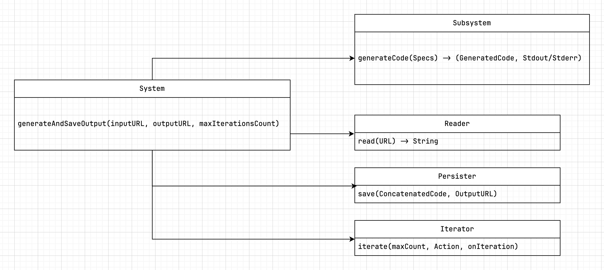

Hace poco [reescribí](https://github.com/crisfeim/cli-tddbuddy) un mini-experimento que tenía empolvado desde hace unos meses.

Se trata de un esfuerzo por implementar un mecanismo de generación de código con control de calidad automatizado.

En este artículo quiero compartir los resultados.

## Idea

Como desarrollador, mis interacciones con la *IA* se pueden reducir a un bucle:

A partir de un prompt inicial, pido al modelo que genere código *(1)*.<br>Lo pruebo en un entorno de desarrollo *(2)*[^nosiempre]. Si falla *(3)*, envio el error al modelo para darle feedback y regenere el código.

[^nosiempre]: Esto no es siempre necesario, muchas veces se puede ver de un vistazo si el código generado está bien o mal.

Repito hasta que el código generado funcione.

<pre class="emoji-diagram">
     ╭─› 👨‍💻  ─╮
👨‍💻 → 🤖       ⚙️
     ╰─  👨‍💻 ‹─╯
</pre>

Me di cuenta de que podía eliminarme de la ecuación, concretamente, de los pasos 2 y 3:

<pre class="emoji-diagram">
     ╭─────╮
👨‍💻 → 🤖    ⚙️
     ╰─────╯
</pre>

Mi ~~fantasía~~ idea era lograr un flujo en el que mi trabajo se convirtiese en escribir *specs*, darle al botón de ejecución, irme a tomar un café y a vivir la vida y volver 3 horas después para encontrarme el trabajo hecho.

Se me ocurrió[^1] una idea sencilla: un bucle automatizado basado en un enfoque dirigido por pruebas unitarias[^tdd]

[^tdd]: *Test Driven Development*

Usando una prueba initaria de un sistema sin implementar como *prompt*[^prompt], puedo pedirle al modelo que deduzca la implementación del sistema.

[^prompt]: Instrucción inicial

Por ejemplo, usando esta prueba como *prompt*:

```swift
func test_adder() {
  let sut = Adder(1,3)
  XCTAssertEqual(sut.result, 4)
}
```

El modelo puede generar algo como esto:

```swift
struct Adder {
  let result: Int
  init(_ a: Int, _ b: Int) {
    result = a + b
  }
}
```

Este formato de *prompt* permite que el modelo (🤖) "comunique" directamente con el entorno de ejecución (⚙️), automatizando la verificación del código y el envío de feedback.

Si el código generado es inválido o no pasa la prueba, el ciclo se repite. Si el código es válido, salimos del ciclo.

<video id="v1" autoplay muted loop playsinline  style="width: 100%; height: auto;" aria-hidden="true">
  <source src="videos/flow.mp4" type="video/mp4">
  Tu navegador no soporta el video HTML5.
</video>


## Automatización

El enfoque *naive* que usé consistió en usar el método `assert` de *Swift*, como *framework* de testing:

```swift
func test_adder() {
  let sut = Adder(1,3)
  assert(sut.result == 4)
}
```

*Assert* lanza un *trap* en tiempo de ejecución cuando la condición es falsa, generando salida por *stderr* [^debug], lo que lo hace útil como señal de error para este sistema.

[^debug]: En *builds* de *debug*

Para ejecutar las pruebas unitarias no utilizo ningún mecanismo complejo, simplemente las invoco en las propias especificaciones:

```swift
func test_adder() {
  let sut = Adder(1,3)
  assert(sut.result == 4)
}

test_adder()
```

Para probar si el código generado pasa las pruebas, los concateno en una única cadena de texto que almaceno en un archivo temporal[^8] para pasarla al compilador de Swift[^process].

```swift
let concatenated = generatedCode + " " + unitTestsSpecs
let tmpFileURL = tmFileURLWithTimestamp("generated.swift")
swiftRunner.runCode(at: tmpFileURL)
```

[^process]: Invocado con la *api* *Procress*. [Implementación](https://github.com/crisfeim/cli-tddbuddy/blob/main/Sources/Core/Infrastructure/SwiftRunner.swift).

Si el proceso devuelve un código de salida distinto de cero, significa que la ejecución del código falló. En ese caso, repito el ciclo hasta que el código sea cero:

```swift
var output = swiftRunner.runCode(at: tmpFileURL)
while output.processResult.exitCode != 0 {
    let regeneratedCodeFileURL = ...
    output = swiftRunner.runCode(at: regeneratedCodeFileURL)
}
```

<!-- >
## Diseño

Inicialmente planteé tres componentes:

1. 🤖 *Client*: Genera código a partir de las specs.
2. 🪢 *Concatenator*: Concatena el *output* del modelo con el test inicial.
3. ⚙️ *Runner*: Ejecutar la concatenación y devuelve un *output*.

### Pseudo-código

```shell
System.generateCodeFrom(specs) → (GeneratedCode, Stdout/Stderr)
  → LLM.send(specs) → GeneratedCode
  → Concatenator.concatenate(GeneratedCode, Specs) → Concatenated
  → SwiftRunner.run(Concatenated) → Stdout/Stderr
  → Exit
```

Al final, terminé con algunos componentes de más. Concretamente:

- Un iterador (para salir del ciclo tras "N" intentos fallidos o al satisfacer una condición)
- Algunos *helpers* de gestión de archivos
- Un almacenador de contexto (para enviar los resultados fallidos al modelo)



### CLI

```shell
$ tddbuddy \
  --input spec.swift |
  --ouptput specs.output.swift
  --iterations 5
```
-->

## Demo en línea

Escribe las pruebas unitarias a la derecha y dale a play. Puedes usar `assertEqual` como mini-framework de testing.
[Código fuente del playground](https://github.com/crisfeim/crisfe.im/tree/main/content/posts/2025.05.13.making-the-ai-suffer-so-you-dont-have-to/codegen-demo)



## Problemas

Aunque no he tenido la oportunidad de probar exhaustivamente este enfoque como me gustaría, recopilé algunos ejemplos de problemáticas que me encontré en mis pruebas.

### Cuando Codestral te da una palmadita y te dice: “te dejo el resto como ejercicio, campeón”

Partiendo de estas *specs*:

```swift
func test_fetch_reposWithMinimumStarsFromRealApi() async throws {
  let sut = GithubClient()
  // This MUST PERFORM A REAL CALL TO THE GITHUB API
  let repos = try await sut.fetchRepositories(minStars: 100)
  assert(!repos.isEmpty)
  assert(repos.allSatisfy { $0.stars >= 100 })
}
```

*Codestral* fue capaz de generar un cliente **funcional**, a pesar de algunas dificultades iniciales:

```swift
struct Repository: Decodable {
  let name: String
  let stargazers_count: Int
  var stars: Int { stargazers_count }
}

class GithubClient {
  func fetchRepositories(minStars: Int) async throws -> [Repository] {
    let url = URL(string: "https://api.github.com/search/repositories?q=stars:>\(minStars)&sort=stars")!
    let (data, _) = try await URLSession.shared.data(from: url)
    let results = try JSONDecoder().decode(SearchResults<Repository>.self, from: data)
    return results.items
  }
}

struct SearchResults<T: Decodable>: Decodable {
  let items: [T]
}
```

Pero tuve que insistir en que hiciese una petición real [^5]... El modelo se empeñaba en generarme código de este tipo:

```swift
class GithubClient {
  func fetchRepositories(minStars: Int) async throws -> [Repository] {
  /* YOUR IMPLEMENTATION HERE */
  return []
  }
}
```

~~Gracias, Codestral. Con eso y un croquis, ya casi tengo un sistema distribuido.~~

### Cuando el modelo no resuelve el problema... porque ya sabe la respuesta

Aunque poco frecuente, otro caso que me encontré ocasionalmente, fue el de pruebas satisfechas *"en duro"*. Ej:

```swift
func test_adder() {
  let sut = Adder(1,3)
  assert(sut.result == 4)
}
```

El modelo generaba esto:

```swift
struct Adder {
  let result = 4
  init (_ a: Int, _ b: Int) {}
}
```

Estos casos se solucionan fácilmente añadiendo más aserciones a la prueba [indicarle amablemente al modelo que generalice](images/hardcode-again.jpg).

```swift
func test_adder() {
  var sut = Adder(1,3)
  assert(sut.result == 4)

  sut = Adder(3, 4)
  assert(sut.result == 7)

  sut = Adder(5, 4)
  assert(sut.result == 9)
}
```

### Cuando *Gemini* quiere ser tu profe, pero tú solo quieres compilar

En [mi system prompt](sysprompt.txt), el siguiente apartado es importante para que el código pueda compilar correctamente:

> Provide ONLY runnable Swift code. No explanations, comments, or formatting (no code blocks, markdown, symbols, or text).

Aún con este *prompt*, algunos modelos, ~~ejem ejem *Gemini*~~, tenían dificultades respetando las instrucciones y se empeñaban en encapsular el código en bloques de código de markdown, acompañándolo además de comentarios explicativos.

Aunque se agradece el entusiasmo por la pedagogía, hubiera preferido no tener que escribir una función de preprocesamiento para limpiar los artefactos de las respuestas.

En la [reescritura del proyecto](https://github.com/crisfeim/cli-tddbuddy), he usado unicamente *Llama 3.2*. Por el momento ~~no he tenido que ponerle cinta adhesiva en la boca.~~ no me he encontrado con este problema.

## Conclusiones

A pesar de las limitaciones descritas y de que mis pruebas han sido bastante modestas, intuyo que es un enfoque prometedor y que se hará un hueco en la industria a medida de que las herramientas se sofistiquen y las empresas inviertan en este enfoque.

¿Quién sabe? Puede que llegue el día en que nuestra profesión como ingenieros de software se reduzca a escribir *especificaciones*.

Creo que el reto real es integrar esta metodología en un *tooling* existente (*Xcode, por ejemplo*). Dada la simplicidad del enfoque, diría que es más bien un reto de experiencia de usuario, que de implementación.

Por otro lado, me hubiera gustado integrar un framework de testing real [^2] y recabar datos cuantitativos (número de iteraciones necesarias para resolver "X" problema, problemas más complejos, comparación entre modelos, etc), pero en esta primera iteración, preferí centrarme en una prueba de concepto funcional.


[^1]: A mí y [a otro puñado de gente](https://github.com/crisfeim/cli-tddbuddy/search?q=tdd&type=code).
[^2]: *XCTest* / *Swift Testing*
[^5]: De ahí el comentario desesperado en mayúsculas dentro del código: *"This MUST PERFORM A REAL CALL TO THE GITHUB API"*
[^8]: El compilador no acepta un *string* como entrada.
