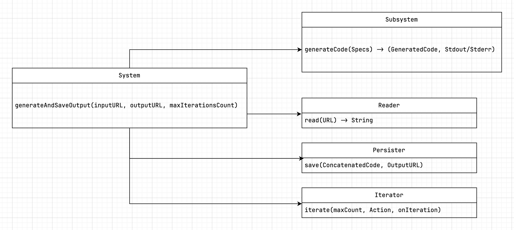

Hace unos meses escribí un mini-experimento para generar código a partir de unit tests con inteligencia artificial.

Al final lo tuve empolvado mucho tiempo, hasta que hace poco lo retomé [rehaciéndolo desde cero](https://github.com/crisfeim/cli-tddbuddy).

En este artículo quiero compartir los resultados.



## Idea

Mis interacciones con la *IA* se pueden reducir siguiente un bucle:

A partir de un prompt inicial *(1)*, el modelo genera código *(2)* que pruebo en un entorno de dev *(3)*.

Si falla *(4)*, envío ese *output* al modelo para que regenere código (5).

Repito el proceso hasta que el código funcione.

```
👨‍💻 → 🤖
🤖 → 👨‍💻
👨‍💻 → ⚙️
⚙️ → 🔴
 ↪︎ Repeat
```

El prompt inicial sigue siendo el mismo, lo único que cambia es la adición del *output* del paso *4*, que uso como feedback para regenerar código.

Me vino la idea a la cabeza (y las ganas) de eliminarme de la ecuación, concretamente, de los pasos 2 y 3:


<video id="v2" autoplay muted loop playsinline  style="width: 100%; height: auto;">
  <source src="video.mov" type="video/mp4">
  Tu navegador no soporta el video HTML5.
</video>

El sueño era lograr un flujo en el que mi trabajo se convirtiese en escribir *specs*, darle al botón de ejecución, irme a tomar un café y volver 3 horas después para encontrarme el trabajo hecho.

Para ello, se me ocurrió[^1] una idea sencilla: un bucle automatizado basado en un enfoque TDD.

A partir de una prueba unitaria inicial, cuyo sistema sea un *SUT* inexistente, pediría al modelo la generación de ese *SUT*.

Para que quede más claro, este es un ejemplo sencillo de *spec*:

```swift
func test_adder() {
  let sut = Adder(1,3)
  XCTAssertEqual(sut.result, 4)
}
```

Si le pedimos al modelo que implemente el *SUT*, querremos que nos devuelva:

```swift
struct Adder {
  let result: Int
  init(_ a: Int, _ b: Int) {
    result = a + b
  }
}
```

Usar una prueba unitaria como prompt permite que el modelo (🤖) se conecte directamente con el entorno de ejecución (⚙️), automatizando la verificación del código y el envío de feedback.

Si la compilación o el test fallan, el ciclo se repite. Si no, rompemos el bucle:

<video id="v1" autoplay muted loop playsinline  style="width: 100%; height: auto;">
  <source src="flow.mp4" type="video/mp4">
  Tu navegador no soporta el video HTML5.
</video>


## Ejecución de código

Para mi primer prototipo, usé Swift y un enfoque *naive* que consistió en usar el método `assert(Bool)` como *framework* de testing[^3].

Para ejecutar el código generado con su test, simplemente los concatenamos en una única cadena y se la pasamos al compilador:

```bash
// Ejemplo de una posible implementación
let concatenated = generatedCode + " " + unitTestsSpecs
let tmpFileURL = tmFileURLWithTimestamp("generated.swift")
swiftRunner.runCode(at: tmpFileURL)
```

El código del *runner* está disponible [aquí](@todo)

## Diseño y componentes del sistema

Para este sistema, inicialmente me planteé tres componentes:

1. 🤖 Cliente LLM: Genera código a partir de las specs.
2. 🪢 *Concatenator*: Concatena el *output* del modelo con el test inicial.
3. ⚙️ *Runner*: Ejecutar la concatenación y devuelve un *output*.

### Pseudo-código

```
System.generateCodeFrom(specs) → (GeneratedCode, Stdout/Stderr)
  → LLM.send(specs) → GeneratedCode
  → Concatenator.concatenate(GeneratedCode, Specs) → Concatenated
  → SwiftRunner.run(Concatenated) → Stdout/Stderr
  → Exit
```

Al final terminé con algunos componentes de más. Concretamente, un iterador (para romper el bucle después de "N" iteraciones) y *helpers* de gestión de archivos:

<a href="system.png"></a>

## Limitaciones

Aunque no he tenido la oportunidad de probar exhaustivamente este enfoque, aquí hay algunos ejemplos y limitaciones que me encontré en el camino.

### Cuando Codestral te da una palmadita y te dice: “te dejo el resto como ejercicio”

Partiendo de estas *specs*:

```swift
func test_fetch_repositories_with_minimum_stars_from_real_api() async throws {
  let sut = GithubClient()
  // This MUST PERFORM A REAL CALL TO THE GITHUB API
  let repos = try await sut.fetchRepositories(minStars: 100)
  if repos.count == 0 {
  fail("List should not be empty")
  }

  if !repos.allSatisfy { $0.stars >= 100 } {
    fail("Fetched repositories should have at least 100 hundred stars")
  }
}

try await test_fetch_repositories_with_minimum_stars_from_real_api()

func fail(_ description: String, function: String = #function) {
  print("❌ — \(function), \(description)")
}
```

A pesar de algunas dificultades iniciales, *Codestral* fue capaz de generar un cliente **funcional**:

```swift
struct Repository: Decodable {
  let name: String
  let stargazers_count: Int
  var stars: Int { stargazers_count }
}

class GithubClient {
  func fetchRepositories(minStars: Int) async throws -> [Repository] {
    let url = URL(string: "https://api.github.com/search/repositories?q=stars:>\(minStars)&sort=stars")!
    let (data, _) = try await URLSession.shared.data(from: url)
    let results = try JSONDecoder().decode(SearchResults<Repository>.self, from: data)
    return results.items
  }
}

struct SearchResults<T: Decodable>: Decodable {
  let items: [T]
}
```

Tuve que insistir en que hiciese una petición real [^5], porque el modelo se empeñaba en generarme cosas de este tipo:

```swift
class GithubClient {
  func fetchRepositories(minStars: Int) async throws -> [Repository] {
/* YOUR IMPLEMENTATION HERE */
  return ...
  }
}
```

~~Gracias, Codestral. Con eso y un croquis, ya casi tengo un sistema distribuido.~~

### Cuando el modelo no resuelve el problema... porque ya sabe la respuesta

Aunque poco frecuente, otro caso que me encontré ocasionalmente, fue el de *outputs hardcodeados*. Ej:

```swift
func test_adder() {
  let sut = Adder(1,3)
  assert(sut.result == 4)
}
```

El modelo generaba esto:

```swift
struct Adder {
  let result = 4
  init (_ a: Int, _ b: Int) {}
}
```

Esto se soluciona fácilmente añadiendo más aserciones al test, [para obligar al modelo a generalizar.](hardcode-again.jpg)

```swift
func test_adder() {
  var sut = Adder(1,3)
  assert(sut.result == 4)

  sut = Adder(3, 4)
  assert(sut.result == 7)

  sut = Adder(5, 4)
  assert(sut.result == 9)
}
```

### Cuando el modelo quiere ser tu profe, pero tú solo quieres compilar

En [mi system prompt](system-prompt.txt), el siguiente apartado es importante para que el código pueda compilar correctamente:

> Provide ONLY runnable Swift code. No explanations, comments, or formatting (no code blocks, markdown, symbols, or text).

Algunos modelos, ~ejem ejem *Codestral*~, tenían dificultades entendiendo el contexto y se empeñaban en encapsular el código en bloques de código de markdown, acompañándolo además de comentarios explicativos.

Y aunque se agradece el entusiasmo por la pedagogía, hubiera preferido que no me obligara a escribir una función de preprocessing para limpiar los artefactos de su output.

En la [reescritura del proyecto](https://github.com/crisfeim/cli-tddbuddy), he usado sólo *Llama 3.2*. Por el momento ~~no he tenido que ponerle cinta adhesiva en la boca.~~ no me he encontrado con este problema.

## Conclusiones

A pesar de las limitaciones descritas y de que mis pruebas han sido bastante modestas, intuyo que es un enfoque prometedor y que se hará un hueco en la industria a medida de que las herramientas se sofistiquen y las empresas inviertan en este enfoque.

¿Quién sabe? Puede que algún día nuestro cotidiano como ingenieros de software se reduzca a escribir *specs*.

Creo que el reto real es integrar esta metodología en un *tooling* existente (*Xcode, por ejemplo*). Dada la simplicidad del enfoque, diría que es más bien un reto de experiencia de usuario, que de implementación.

Por otro lado, me hubiera gustado integrar un framework de testing real [^2] y recabar datos cuantitativos (número de iteraciones necesarias para resolver "X" problema, problemas más complejos, comparación entre modelos, etc), pero preferí centrarme primero en tener una prueba de concepto funcional. Queda como tarea pendiente.

## Demo en línea

> Un playground vale más que mil palabras.

[Código fuente del playground](https://github.com/crisfeim/app-web-tddbuddy)

[^1]: A mí y [a otro puñado de gente](https://github.com/crisfeim/cli-tddbuddy/search?q=tdd&type=code).
[^2]: *XCTest* / *Swift Testing*
[^3]: El método assert lanza un trap en tiempo de ejecución cuando la condición es falsa, generando salida por *stderr* (en *builds* de *debug*), lo que lo hace útil como señal de error para este sistema
[^5]: De ahí el comentario desesperado en mayúsculas dentro del código: *"This MUST PERFORM A REAL CALL TO THE GITHUB API"*
[^8]: El compilador no acepta un *string* como entrada.
