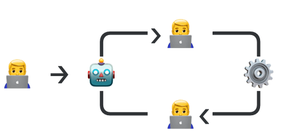

### tl;dr

On building a system where an LLM writes code based on unit test specs, compiles it, runs it, and — if it fails — tries again until it gets it right. All without human feedback loops. This article explains the architecture, prompt setup, challenges, and some results I gathered while letting the machine suffer through trial and error.

## Introduction

What happens if you delegate the boring work to an AI?

That was the starting point of this experiment: building a system that not only automatically generates code from specifications, but compiles it, tests it, and repeats until it gets it right — without human intervention.

The idea was to turn the developer's role into writing tests, hitting the execute button, and disappearing. If the model makes mistakes, let it correct itself. If it crashes, let it get back up. If it gives up... well, let's give it a break.

In this article, I'll tell you how I set up this automation system with feedback loops and what I learned in the process.

## Idea

As a developer, my interactions with *AI* can be reduced to a loop:

*(1)* From an initial prompt, I ask the model to generate code.<br>
*(2)* I test it in a development environment<br>
*(3)* If it fails, I send the error to the model to give it feedback and have it regenerate the code.

I repeat the cycle until the generated code works.

I realized I could eliminate myself from the equation, specifically, from steps *(2)* and *(3)*:



My ~~fantasy~~ idea was to achieve a flow where my work would become writing *specs*, hitting the execute button, going for coffee, enjoying life and then returning 3 hours later to find my job done.

I came up with a simple idea[^notoriginal]: an automated loop based on a unit test-driven prompting approach.

[^notoriginal]: Although not original: [cf. github](https://github.com/search?q=tdd%20ai&type=repositories).


If we use a test of a system without implementation as a *prompt*, we can ask the model to deduce it from the test assertions.

For example, this is explicit enough for the model to understand what we want:

```swift
func test_adder() {
  let sut = Adder(1,3)
  XCTAssertEqual(sut.result, 4)
}
```

From that unit test, the model will be able to generate any code variant that satisfies the assertions (e.g.):

```swift
struct Adder {
  let result: Int
  init(_ a: Int, _ b: Int) {
    result = a + b
  }
}
```

This *prompt* format allows the model (🤖) to "communicate" directly with the execution environment (⚙️), automating code validity verification and the feedback loop.

If the generated code is invalid or doesn't pass the test, the cycle repeats. If the code is valid, we exit the loop.


### Prompt

This is the *prompt* I used in my tests. It can certainly be improved, but it worked for the *POC*:

> Imagine that you are a programmer and the user's responses are feedback from compiling your code in your development environment. Your responses are the code you write, and the user's responses represent the feedback, including any errors.
>
> Implement the SUT's code in Swift based on the provided specs (unit tests).
>
>Follow these strict guidelines:
>
> 1. Provide ONLY runnable Swift code. No explanations, comments, or formatting (no code blocks, markdown, symbols, or text).
> 2. DO NOT include unit tests or any test-related code.
> 3. ALWAYS IMPORT ONLY Foundation. No other imports are allowed.
> 4. DO NOT use access control keywords (`public`, `private`, `internal`) or control flow keywords in your constructs.
>
> If your code fails to compile, the user will provide the error output for you to make adjustments.

The first point is important to get runnable code, otherwise formatting or explanations will make the process fail when passing the model's response to the compiler.

The point two avoids the model from including the specs (thus duplicating it as you'll see in the next section)

The point three is relevant because can try to import libraries unavailable on our development environment setup (basically *swiftc*) making the run fail.

## Automation

The *naive* approach I used to execute the generated code against the tests consisted of using Swift's `assert` method as a testing *framework*:

```swift
func test_adder() {
  let sut = Adder(1,3)
  assert(sut.result == 4)
}
```

*Assert* throws a *trap* at runtime when the condition is false, generating output to *stderr*, making it useful as an error signal for this system.

To execute the unit tests, we simply invoke them manually in the specifications themselves:

```swift
func test_adder() {
  let sut = Adder(1,3)
  assert(sut.result == 4)
}

test_adder()
```

We concatenate the generated code and unit tests into a single text string that we store in a temporary file and pass it to the compiler[^process].


```swift
let concatenated = generatedCode + "\n" + unitTestsSpecs
let tmpFileURL = tmFileURLWithTimestamp("generated.swift")
swiftRunner.runCode(at: tmpFileURL)
```

[^process]: *swiftc* invoked with the *Process* api. [Implementation](https://github.com/crisfeim/cli-tddbuddy/blob/main/Sources/Core/Infrastructure/SwiftRunner.swift).

If the process returns an exit code other than zero, it means the code execution failed. In that case, we repeat the cycle until the code is zero:

```swift
var output = runCode(at: tmpFileURL)
while output.processResult.exitCode != 0 {
    ...
    output = runCode(at: tmpFileURL)
}
```

## Try it Yourself

I have prepared a javascript playground so you can test the concept.

Write the specifications on the left and hit the *play* button.

I use *javascript's eval* method to evaluate the code. There's an injected `assertEqual` method so you can assert.

Available models are *GPT-3.5*[^llm7], *Gemini* (requires api-key) and *Llama3.2*.

[^llm7]: Courtesy of *llm7*

To use *Llama3.2* you'll need to [download the demo's *index.html*](demo) and serve it from a local server.



## System Design

These are the core components of the system:

1. 🤖 *Client*: Generates code from specs.
2. 🪢 *Concatenator*: Concatenates the model's *output* with the initial test.
3. ⚙️ *Runner*: Executes the concatenation and returns an *output*.
4. 🔁 *Iterator*: Iterates *N* times or until a condition is met.
5. 💾 *Persister*: Saves the result of each iteration to a file.
6. 💬 *Context*: Saves the context of the previous execution to send as feedback in the next one.

### Pseudo-code

I comportamentized the generation and running logic of a single run into a subsystem:

```
Subsystem.genCode(specs, feedback?) → (GeneratedCode, Stdout/Stderr)
  → LLM.send(specs + feedback) → GeneratedCode
  → Concatenator.concatenate(GeneratedCode, Specs) → Concatenated
  → SwiftRunner.run(Concatenated) → Stdout/Stderr
  → Exit
```

Then the system coordinates the iterations and pesist on success:
```
System.genCode(inputURL, outputURL, maxIterations)
  → Context.save(IterationResult)
  → Iterator.iterate(maxIterations, Subsystem.genCode)
     isSuccess
      ? Persister.save(outputURL, IterationResult)
      :()
```

Iterator encapsulates the iteration logic and returns the last result:

```swift
iterate<T>(
  nTimes: Int,
  action: () async -> T,
  until: (T) -> Bool
) async -> T
```

It allows consumers to break loop by using a *closure* that provides the current iteration result so they can decide:

```swift
while currentIteration < nTimes {
  let result = await action()
  if until(result) { ... return and break ...}
}
```

The same closure can be used to save context:

```swift
let context = ContextBuilder(window: 5)
let messages = makeMessages(context, sysPrompt, specs)
iterator.iterate(
        nTimes,
        action: { generateCode(messages) },
        until: { context.insert($0) ; return $0.isSuccess }
)
```

For simplicity, the web playground context contains only the result of the previous iteration which is often more than enough:

```ts
let previousFeedback: string | undefined
const makeMessages = (sysPrompt, specs, previousFeedback)
return await this.iterator.iterate(
  maxIterations,
  async () => await this.generateCode(messages),
  (result) => { previousFeedback = result.stdErr;  return result.isValid })
)
```

### Contracts

To make the project flexible and *testable*, the actors are modeled with *protocols* instead of concrete implementations:

```swift
protocol Client {
    func send(messages: [Message]) async throws -> String
}

protocol Runner {
    func run(code: String) -> String
}

protocol Perister {
    func persist(code: String, to outputURL: String) throws
}

protocol Reader {
    func read(_ inputURL: String) throws -> String
}
```

Thanks to this approach, we can add new models, alternative runners, or even storage systems without touching the main program logic. This also simplifies testing.

## Data

The first version of the project was very simple: A few *Swift* files compiled with *swiftc*[^coderunner].

I did a few tests with different specifications and models and originally planned to gather data to make visual comparisons, but ultimately, I only had the opportunity to log basic data.

[^coderunner]: With the *amazing CodeRunner app*

Unfortunately, I lost the results of those few tests I did. Though, I have found some of the outputs from *Codestral*, you'll find the output code and specs generated in this online playgrounds:





Hit the *play* button to see the running output (no output means no running errors)

In the other hand, the worst performing model was *Gemini* and the best performers were *Claude* and *ChatGPT*.

*Llama 3.2 (8B)* gave variable results on my machine[^machine], although the iteration speed gains from being a local execution somewhat compensated the shortcomings.

[^machine]: *Macbook Pro M2 2022 16GB*.

The average number of iterations for easy problems like the adder (and similar ones: multiplier, divider, etc...) was unsurprisingly low (between 1-2).

If I recall correctly, *Codestral* took around 15 iterations to generate the *PasswordGenerator* provided above.

## Issues

I haven't had the opportunity to test this approach as exhaustively as I'd like, but I was able to collect some examples of issues I encountered along the way.

### When Codestral says: "I'll leave the rest to you"

Starting from these *specs*:

```swift
func test_fetch_reposWithMinimumStarsFromRealApi() async throws {
  let sut = GithubClient()
  // This MUST PERFORM A REAL CALL TO THE GITHUB API
  let repos = try await sut.fetchRepositories(minStars: 100)
  assert(!repos.isEmpty)
  assert(repos.allSatisfy { $0.stars >= 100 })
}
```

*Codestral* was able to generate a **functional** client:

```swift
struct Repository: Decodable {
  let name: String
  let stargazers_count: Int
  var stars: Int { stargazers_count }
}

class GithubClient {
  func fetchRepositories(minStars: Int) async throws -> [Repository] {
    let url = URL(string: "https://api.github.com/search/repositories?q=stars:>\(minStars)&sort=stars")!
    let (data, _) = try await URLSession.shared.data(from: url)
    let results = try JSONDecoder().decode(SearchResults<Repository>.self, from: data)
    return results.items
  }
}

struct SearchResults<T: Decodable>: Decodable {
  let items: [T]
}
```

But initially the model kept giving me this instead:

```swift
class GithubClient {
  func fetchRepositories(minStars: Int) async throws -> [Repository] {
  /* YOUR IMPLEMENTATION HERE */
  }
}
```

I appreciate the trust in my dev skills, but for the sake of the experiment, I'd rather not have to code. So I forced a bit by adding comments to the specs.
Though, the problem persisted intermittently.

### When the model cheats

Although infrequent, another case I occasionally encountered was tests being satisfied by hardcoded expected results (e.g.):[^justexample]

[^justexample]: Not a real case, but useful to illustrate the problem.

```swift
func test_adder() {
  let sut = Adder(1,3)
  assert(sut.result == 4)
}
```

Output:

```swift
struct Adder {
  let result = 4
  init (_ a: Int, _ b: Int) {}
}
```

These cases are easily solved by adding more assertions to the test:

```swift
func test_adder() {
  var sut = Adder(1,3)
  assert(sut.result == 4)

  sut = Adder(3, 4)
  assert(sut.result == 7)

  sut = Adder(5, 4)
  assert(sut.result == 9)
}
```

### When *Gemini* wants to be your teacher, but you just want it to compile

In the *system prompt* we defined, the following section is important for the code to compile correctly:

> Provide ONLY runnable Swift code. No explanations, comments, or formatting (no code blocks, markdown, symbols, or text).

Even with this *prompt*, some models (*Gemini* and *Llama 3.2*), had difficulty respecting the instructions and insisted on encapsulating the code in markdown code blocks, also accompanying it with explanatory comments.

While the enthusiasm for pedagogy and teaching spirit is appreciated, I would have preferred not having to write a preprocessing function to clean the artifacts from the responses.

## Limitations

This idea assumes specifications you provide are completely adjusted to the system beforehand, which is unrealistic for almost every project.

It also assumes that the specifications have no logic errors. Which is less likely to happen, but it does.

When developing using *TDD*, specification details usually "emerge" naturally as your understanding on the system grows: The process is a *framework* for thinking.

Often we rewrite or eliminate tests as we learn about the system. So we never really start with final specs.

A worth exploring solution for this may be have a second model regenerating specs after *N* failed attemps. It also may help providing the unit tests incrementally rather than the whole spec (so it can validate each step progressivelly (which mirrors the dev *TDD* workflow)

For complex problems, I think the idea could be useful for automated exploration : Letting the AI explore implementation path and log the attemps and compiler feedback. Then using it as a reference/inspiration for tackle the problem.

It may also be useful for common repetitive problems that have always the same shape. For example, testing a system that delivers data/error based on the items it coordinates (e.g.):

```swift
// Sad paths
func test_generate_deliversErrorOnClientError() {
    let sut = makeSUT(alwaysFailingClient())
    XCTAssertThrowsError(sut.generate())
}
func test_coordinator_deliversErrorOnRunnerError() async {
    let sut = makeSUT(alwaysFailingRunner())
    XCTAssertThrowsError(sut.generate())
}
func test_coordinator_deliversErrorOnPersisterError() async {
    let sut = makeSUT(alwaysFailingPersister())
    XCTAssertThrowsError(sut.generate())
}
...
// Happy paths
func test_coordinator_deliversDataClientSuccess() async {}
func test_coordinator_deliversDataOnRunnerSuccess() async {}
func test_coordinator_deliversDataOnPersisterSuccess() async {}
```

I think those cases are "easy" enough to be successfully automated by this approach, but I've not tested the system yet with thise cases.

## Conclusions

Although this experiment has clear limitations, I find is promising.

Finding useful application could free up time for more relevant development tasks, as long as the problem we provide to the model is well-scoped. In that sense, this type of system could be especially useful for repetitive or highly structured tasks.

The real challenge would be identifying useful opportunities and integrating this is into a daily workflow without friction.

## Future Ideas

There are many things left to explore. This was a proof of concept focused on the simplest possible flow, but there's room to make the system more robust, flexible, and useful in real contexts.

Some directions I'd be love to explore:

- Integrate an actual testing framework.
- Automatically generate tests for common structures with mocking.
- Use design mockups as a specification and validate output with snapshot assertions.
- Execute parallel requests with multiple models and break iteration as soon as one passes the test.
- Dynamically adjust the prompt based on *N* consecutive failures, using another model as a refiner.
- Incremental unit test with validated steps being commited to git so we prevent regresions and facilitate problem digestion to the model.
- Look for opportunities to integrate this idea in daily workflows.
- Use better models extensively (*Claude* and *ChatGPT*).
- Experimenting with compiler feedback preprocessing before passing it to the model to see if that actually improves speed.
- Have a more academic aproach: Gather and present useful data for next articles (e.g.,  get the average number of iterations for a given problem per model by stressing it *N* times).
- Test different prompts, specifically, try having the model formatting its response in a parasable mini-dsl or [json](https://github.com/crisfeim/poc-aidriven-app/blob/main/macApp/AI_Counter/SystemPrompt.swift) to avoid unwanted explanations.

## Links

1. [LLM7](llm7.io)
2. [Playground source code](https://github.com/crisfeim/crisfe.im/tree/main/content/posts/2025.05.13.making-the-ai-suffer-so-you-dont-have-to/codegen-demo)
3. [CLI (work in progress)](https://github.com/crisfeim/cli-tddbuddy)
